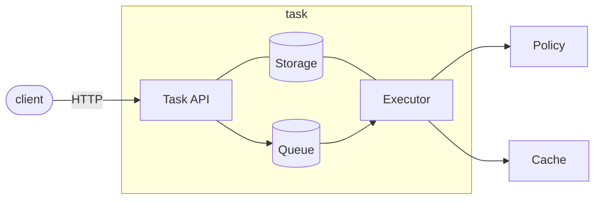

[](https://github.com/eclipse-xfsc/task-sheduler/-/commits/main)
[](https://github.com/eclipse-xfsc/task-sheduler/-/commits/main)

# Task Service

The task service provides an HTTP interface for executing asynchronous (HTTP) [Tasks](docs/task.md) and [Task lists](docs/task-list.md).

It is developed using the [Goa v3](https://goa.design/) framework.

> A helper script named `goagen.sh` can be found inside the root directory of
> the service. It can be used to generate the transport layer code from the
> Goa DSL definitions in the [design](./design) directory. The script should
> be executed everytime the design definitions are updated. It also generates
> updated OpenAPI documentation from the DSL.

[OpenAPI Swagger Documentation](https://github.com/eclipse-xfsc/task-sheduler/-/blob/main/gen/http/openapi3.json). In the local docker-compose
environment, the Swagger URL is available at http://localhost:8082/swagger-ui/

### High-level Overview



Tasks are created by clients making HTTP requests.
In order to create a Task, a TaskTemplate must be present in the Storage. The newly created tasks are
added to a Queue. Current implementation of the [Queue interface](internal/service/queue.go)
is a persistent database. An executor component is retrieving tasks from the Queue for execution.
Clients receive an immediate response with the `taskID` for the created task and can later query
the state of task and retrieve its result either by directly querying the Cache
service, or by querying the task HTTP interface for task results.

### Configuration

The task service is configured using the [Configuration File](./internal/config/config.go).
All configurations are expected as Environment variables specified in the
configuration file. For managing the configuration data from ENV variables,
[envconfig library](https://github.com/kelseyhightower/envconfig) is used.

### More information
* [Tasks](docs/task.md)
* [Task lists](docs/task-list.md)
* [Queue](docs/queue.md)
* [Storage](docs/storage.md)


### Cache events

Task service is able to subscribe for events produced by the Cache service
and create a Task for every received event. Current implementation uses
[NATS](https://nats.io/) for messaging system.

##### More information
* [Cache Event Task](docs/cache-event-task.md)

### Tests and Linters

To execute the units tests for the service go to the root project directory and run:
```go
go test -race ./...
```

To run the linters go to the root project directory and run:
```go
golangci-lint run
```

### Build

##### Local binary
To make the service binary locally, you can run the following command from the root
directory (you must have [Go](https://go.dev/) installed):
```shell
go build -o task ./cmd/task/...
```

##### Docker image

You can see the Dockerfile of the service under the [deployment](./deployment) directory.
There is one Dockerfile for use during local development with [docker-compose](./deployment/compose/Dockerfile) and one for
building an optimized production image: [deployment/docker/Dockerfile](./deployment/docker/Dockerfile).

### Versioning

There is one global exported variable named `Version` in `main.go`. The variable is set
to the latest tag or commit hash during the build process. You can look in the production
Dockerfile to see how the Version is set during build. The version is printed in the service
log on startup and can be used to verify which specific commit of the code is deployed.

> Version should *not* be set or modified manually in the source code.

### Logging

The service outputs all logs to `stdout` as defined by the best practices in the Cloud Native
community. See here for more details [12 Factor App](https://12factor.net/logs).
From there logs could be processed as needed in the specific running environment.
The standard log levels are `[debug,info,warn,error,fatal`] and `info` is the default level.
If you want to set another log level, use the ENV configuration variable `LOG_LEVEL` to set it.

## Dependencies

The project uses Go modules for managing dependencies, and we commit the `vendor` directory.
When you add/change dependencies, be sure to clean and update the `vendor` directory before
submitting your Merge Request for review.
```shell
go mod tidy
go mod vendor
```

[Dependencies](go.mod)

## Deployment

[Helm deployment documentataion](deployment/helm/README.md)

## GDPR
<hr/>

[GDPR](GDPR.md)

## License
<hr/>

[Apache 2.0 license](LICENSE)
